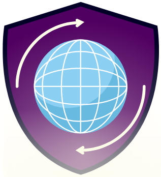
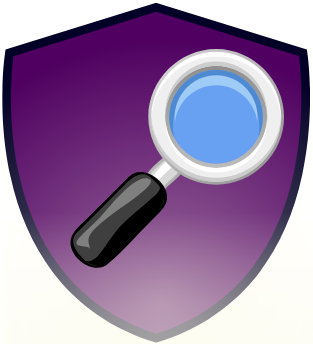
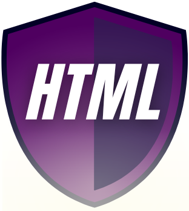
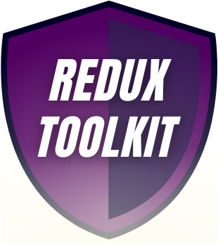

#  Portfolio Website 

 Made by Klaudia Kępka

##  Portfolio Demo Website:
[Portfolio Demo Website](https://kepkaklaudia.github.io/portfolio/)

##  Quick Preview

##

# Getting Started with Create React App

This project was bootstrapped with [Create React App](https://github.com/facebook/create-react-app).

## Available Scripts

In the project directory, you can run:

### `npm start`

Runs the app in the development mode.\
Open [http://localhost:3000](http://localhost:3000) to view it in your browser.

The page will reload when you make changes.\
You may also see any lint errors in the console.

## Technologies used
        

        