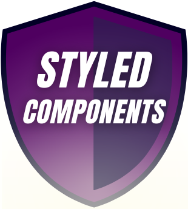
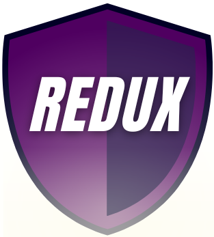

#  Portfolio Website 

 Made by Klaudia Kępka

##  Portfolio Demo Website:
[Portfolio Demo Website](https://kepkaklaudia.github.io/portfolio/)

##  Quick Preview

## Description
My Portfolio Website build in React using Bootstrap, Framer-Motion, React-Router, React-Redux with calling API to fetch GitHub projects. Highly customized with styled-components (up to 6 themes available) and fully designed by me (with strong eye for details 🧐). Here you can find out more about me - who I am, what I can do and how i like to spend my free time🦾.

## Projects - API Data
In order to list projects, with links to demos and repositories, i used GitHub API.

If fetching data from the API fails, the ❌error message will be presented to the user.

## Loading state
Both when downloading data from the API or simply loading the photo gallery, the user will see the ⏳loading status. The animation effect was achieved using SVG path animation in Framer Motion.

## Responsiveness
The site has been designed for users of all devices - from 🖥 computers, through tablets, to mobile devices📱. The layout changes depending on the screen size so that each of the subpages is displayed correctly.

## Getting Started with Create React App

This project was bootstrapped with [Create React App](https://github.com/facebook/create-react-app).

## Available Scripts

In the project directory, you can run:

### `npm start`

Runs the app in the development mode.\
Open [http://localhost:3000](http://localhost:3000) to view it in your browser.

The page will reload when you make changes.\
You may also see any lint errors in the console.

## Technologies used
        

        